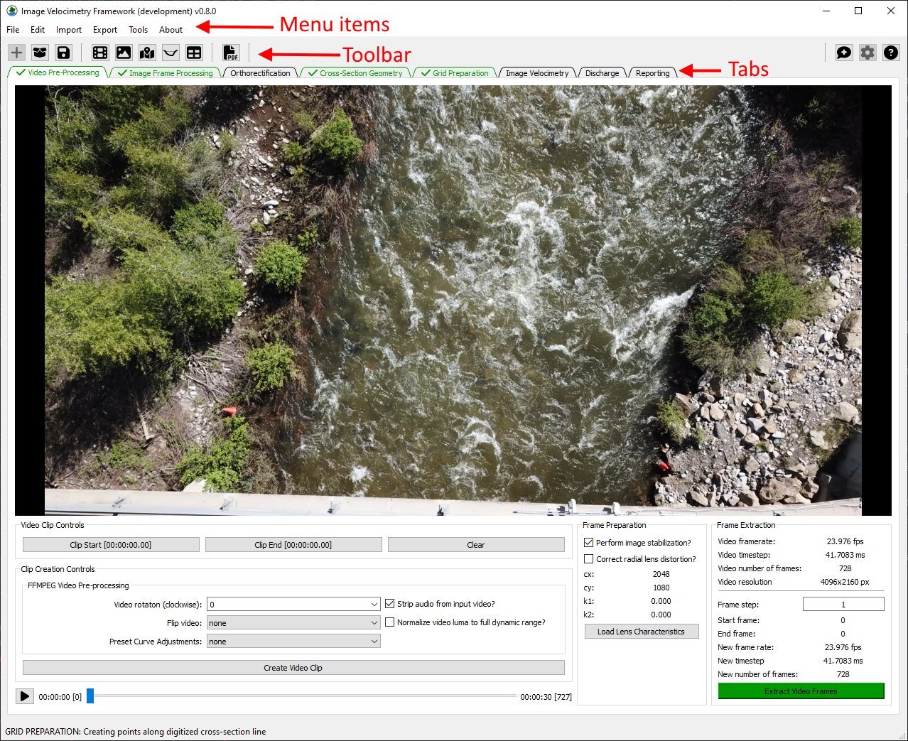

Image Velocimetry Tools (IVyTools) User Guide
============================================
Overview
--------
Image Velocimetry Tools, or **IVyTools**, is software for processing
video and imagery into water velocity and streamflow measurements. IVy
prepares imagery for processing and supports processing of
imagery sequences using Space-Time Image Velocimetry (STIV) algorithms to
generate velocities and streamflow.

IVyTools Layout and Workflow Overview
^^^^^^^^^^^^^^^^^^^^^^^^^^^^^^^^
The **IVyTools** interface is designed to promote a standard workflow. This
workflow is established by tabs separating typical **IVyTools** project
tasks. As you work through each task, the tab provides feedback using
color and icons.

How this documentation is organized
^^^^^^^^^^^^^^^^^^^^^^^^^^^^^^^^^^^

The **IVyTools** documentation is organized by the layout of tabs in the
application. These tabs allow users to process videos into velocities and
streamflow. Below is more information about each tab.

**Tabs:**

* `Video Pre-Processing <./source/video_preprocessing_tab.html>`_ – video import, motion stabilization, and related video pre-processing tasks.
* `Image Frame Processing <./source/image_frame_processing_tab.html>`_ – a browser for viewing extracted image frames and applying image filtering and contrast adjustments.
* `Orthorectification <./source/orthorectification_tab.html>`_ – transformation of perspective imagery into rectified maps with ground scale.
* `Cross-Section Geometry <./source/cross_section_geometry_tab.html>`_ – channel bathymetry and cross-section geometry management.
* `Grid Preparation <./source/grid_preparation_tab.html>`_ – image velocimetry results grid manager.
* `Image Velocimetry <./source/image_velocimetry_tab.html>`_ – contains all **IVyTools** image velocimetry related processing methods.
* `Space-Time Image Velocimetry (Exhaustive) <./source/space_time_image_velocimetry_exhaustive_tab.html>`_ – a comprehensive two-dimensional implementation of Space-Time Image velocimetry.
* `Space-Time Image Results <./source/space_time_image_results_tab.html>`_ – viewer to example space-time images.
*  `Discharge <./source/discharge_tab.html>`_ – convert surface velocities into discharge (streamflow) with uncertainty using cross-section geometry.
*  `Uncertainty <./source/uncertainty.html>`_ – a discussion of how uncertainty is estimated by IVyTools.
* `Reporting <./source/reporting_tab.html>`_ – generate documentation of the measurement suitable for archival.

The left navigation pane contains a table of contents for browsing the
complete documentation.

The right pane contains a general listing of the current contents for the
currently active page, organized by headings.

There are tools across the top of the main (center) section of the
documentation to enable moving around, exporting documentation, toggling
full-screen reading mode, switching between a light and dark theme, and
searching.

Suggested Citation
^^^^^^^^^^^^^^^^^^

The **IVyTools** application can be cited as:

* Engel, F. L., and Knight, T. (2025). Image Velocimetry Tools (IVyTools): U.S. Geological Software Release, `https://doi.org/10.5066/P1KMVCNY <https://doi.org/10.5066/P1KMVCNY>`_.

The STIV algorithm employed in **IVyTools** is fully described in this paper:

* Legleiter, C.J., Kinzel, P.J., Engel, F.L., Harrison, L.R., and Hewitt, G., 2024, A two-dimensional, reach-scale implementation of space-time image velocimetry (STIV) and comparison to particle image velocimetry (PIV): Earth Surface Processes and Landforms, `https://doi.org/10.1002/esp.5878 <https://doi.org/10.1002/esp.5878>`_.

Code Documentation
^^^^^^^^^^^^^^^^^^

A complete listing of all module and function documentation can be explored
through the `Code Documentation <./source/codedocumentation.html>`_ page. This
page contains an index and search
feature to aid in navigation.

Setting up the Development Environment
^^^^^^^^^^^^^^^^^^^^^^^^^^^^^^^^^^^^^^

It is possible to configure and run **IVyTools** from the source code by following
the guidance and instructions for
`Setting up the development environment <./source/setup.html>`_.

.. toctree::
   :hidden:

   self
   ./source/saving.md
   ./source/video_preprocessing_tab.md
   ./source/image_frame_processing_tab.md
   ./source/orthorectification_tab.md
   ./source/cross_section_geometry_tab.md
   ./source/grid_preparation_tab.md
   ./source/image_velocimetry_tab.md
   ./source/space_time_image_velocimetry_exhaustive_tab.md
   ./source/space_time_image_results_tab.md
   ./source/discharge_tab.md
   ./source/reporting_tab.md
   ./source/changelog.md
   ./source/system_requirements.md
   ./source/codedocumentation.rst
   ./source/glossary.md

