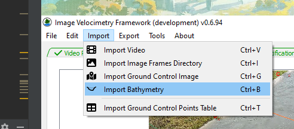

# Cross-Section Geometry Tab

The Cross-Section Geometry tab contains items related to associating
channel bathymetry measurements with the location of a cross-section
survey line in the image. This process step should take place after the
raw imagery has been orthorectified. The basic workflow for adding
cross-section geometry is as follows:

1.  Load an AreaComp3 MAT-file with the survey geometry.

2.  Draw the location of the cross-sectional survey in either the
    original or rectified image browser within the Cross-Section
    Geometry tab.

If rectified image frames exist, the Cross-Section Geometry tab will
look like this:

## Load Area Comp 3 Channel Geometry

To process image velocimetry into streamflow, **IVyTools** requires
predetermined cross-section channel geometry.

Load an AreaComp3 MAT-file using the Import Bathymetry (Ctrl+B) menu
option.

**Note:** The correct use of AreaComp3 is not covered in this manual.

**Note: IVyTools** will convert AreaComp3 geometry into English units.

Once the AreaComp3 MAT-file is loaded, the channel geometry will be
plotted on the right side of the tab.

**Note:** The vertical and horizontal grey lines are sliders. The user
can move them to expand or contract the area of the tab containing the
plots.

## Draw the Location of the Cross-section in the Image

Once the channel geometry is loaded, the user can draw the location of
the cross-section on the image. This process is needed because it
creates the relationship between the pixel and world coordinate systems
relative to the channel cross-section survey. The cross-section location
can be drawn on either the Original or Rectified image browser (if using
the 3D rectification method, the cross-section must be drawn on the
Rectified image).

**Note:** it is helpful to move the vertical bar to the right, shrinking
or collapsing the Cross Section plot to make seeing the Original and
Rectified images easier.

Select the appropriate start bank location for the channel cross-section
line, choose which image to draw the line on, and then press the Add
Cross-Section tool
(). This will start a line edit
mode. Click once in the image to start the cross-section line. Moving
the mouse will draw a line where the mouse is located in the image:

Click on the location corresponding to the end of the cross-section to
“set” the line. Untoggle the Add Cross-section button (shaded blue when
**IVyTools** is still in edit mode) to exit edit mode and finish adding
the cross-section line.

**Note:** To move or redo the cross-section location, turn the Add
Cross-section Line button back on to clear the existing line and restart
the line edit process.

## Enter Cross-section Pixel End Points

If the cross-section pixel coordinates is known in the rectified image,
these values can be used to place the cross-section rather than using
the drawing tools. Enter the left bank and right bank pixel X and Y
coordinates in the edit boxes. As the coordinates are entered, the
current position of the cross-section will be drawn in the rectified
image.

**Note:** the pixel coordinates are referenced to the *rectified image*
only. When this feature is used, the cross-section may not be rendered
in the perspective image.
