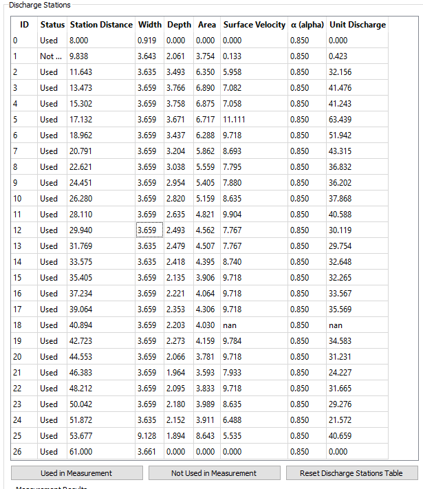
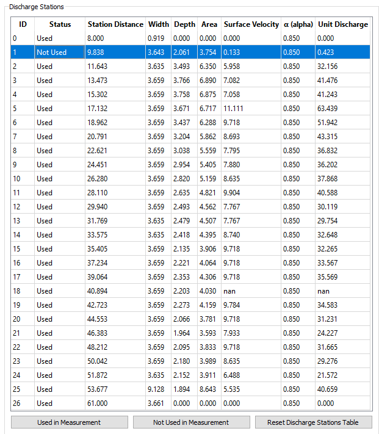
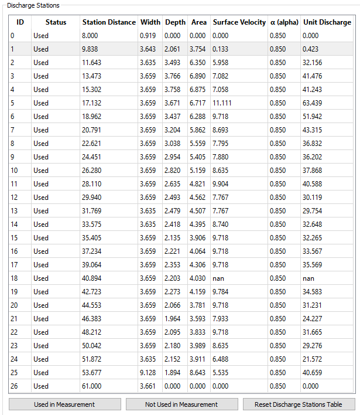
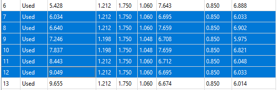
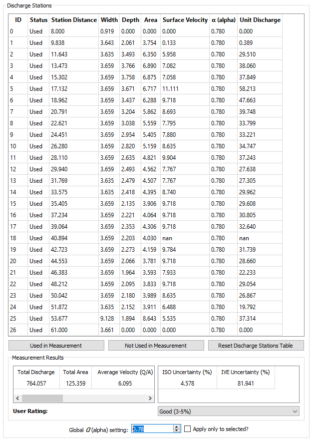
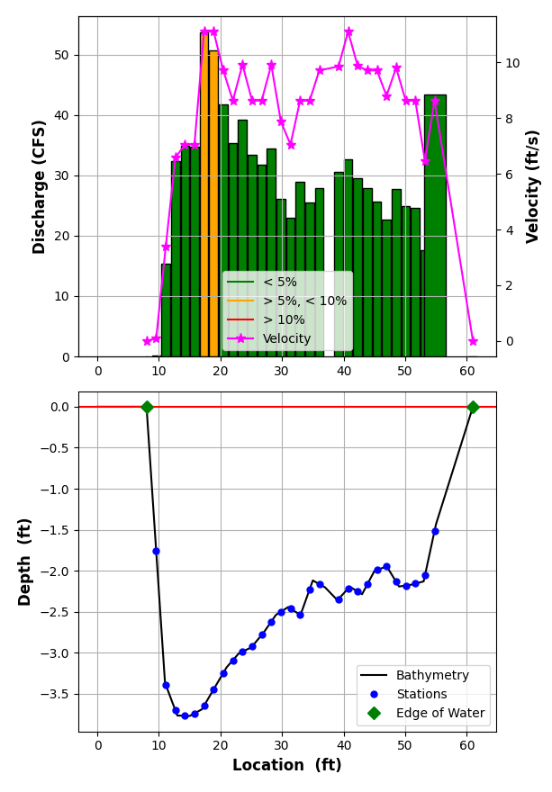
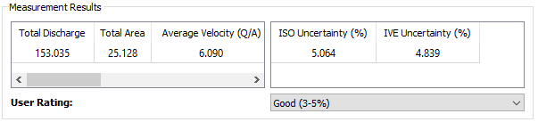

# Discharge Tab

The Discharge tab provides the necessary tools to compute discharge and
discharge uncertainty from the existing cross-sectional geometry and
image velocimetry results. The workflow for completing a discharge
measurement in the Discharge tab is as follows:

1.  Review the Discharge Stations results

2.  Mark stations as Used or Not Used

3.  Adjust alpha settings

4.  Review Plots

5.  Review Uncertainty Calculations and Apply User Rating

## Review the Discharge Stations Results Table

When **IVyTools** completes the Image Velocimetry processing and
cross-section geometry exists, the results will be shown in the
Discharge Stations table. **IVyTools** will compute discharge using the
midsection method as described in [Turnipseed and Sauer
(2010)](https://doi.org/10.3133/tm3A8).

**IVyTools** will add beginning and end nodes (shore nodes) to the table
with a velocity of 0.00. Each node is assigned a “Used” or “Not Used”
status. If the STIV velocity for a particular node is invalid, the node
is automatically assigned a “Not Used” status in the Discharge Stations
table.

Station Distance, Width, Depth, and Area are computed using the
midsection method approach.

The Surface Velocity is the *velocity component perpendicular to the
cross-section line (normal velocity).*

The *α* (alpha) coefficient describes the relationship between the
surface velocity and vertically-averaged velocity in a station, as
described in [Rantz (1982, vol. 1)](https://doi.org/10.3133/wsp2175).

## Mark Stations Used or Not Used

Occasionally, errant surface velocities will be computed for some nodes
that pass the validity tests of the STIV algorithm. In these cases,
manually marking some stations as “Not Used” may be necessary. To mark
Stations, select the appropriate row(s) in the Discharge Stations table.
It is possible to select multiple rows using Shift+Select or Ctrl+Select
methods (arrow keys, mouse clicks).

Once the appropriate row(s) are highlighted, click the Not Used in
Measurement button to change the selected rows’ Status to “Not Used”.

Conversely, click the Used in Measurement button to change the selected
row(s) status to “Used.”

**Note: IVyTools** will update the discharge plots and total discharge
values whenever changes are made to the Discharge Stations table. The
User can also update the table using the Refresh Discharge Stations
Table button.

## Adjust Alpha Settings

The User can specify either a Global or per-station *α* (alpha)
coefficient.

To apply alpha changes to specific stations, select the row(s) in the
table as needed.

Ensure the “Apply only to selected?” check box is checked and enter a
new alpha value. This will update the table and the final discharge
value.

To apply a global change to alpha, uncheck the “Apply only to selected?”
box, update the alpha value, which will apply the new global alpha to
the measurement.

**Note:** clicking the Reset Discharge Stations Table button will
restore the default alpha value of 0.85. Note the Global alpha number
will stay set to the last user setting. Editing this number will
re-apply any global or selected alpha changes.

## Review Plots

Anytime the Refresh Discharge Stations Table button is pressed, or there
are changes to Station Status, the discharge result plots are updated.

The top figure plots the resulting Surface Velocities (normal
velocities) as a magenta line. It also plots unit discharge values as
bars for each station with a “Used “ status in the measurement. The bars
are colored according to the percentage of discharge each station
contributes to the total discharge.

The bottom figure illustrates the cross-sectional geometry for the
measurement, represented by a black line. Stations marked “Used” are
plotted as blue dots. The computed “wetted top width” of the
cross-section is indicated by the Edge of Water points, symbolized by
green diamonds.

## Review Uncertainty Calculations and Apply User Rating

**IVyTools** computes total estimate discharge uncertainty using two
methods. First, it uses the [ISO
748:2007](https://www.iso.org/standard/37573.html) approach for
computing the uncertainty of midsection (velocity area) measurements.
Second, It computes the Interpolated Variance Estimator (IVE) estimated
uncertainty based on the methods described by [Cohn and others
(2013)](https://doi.org/10.1061/(ASCE)HY.1943-7900.0000695).

**IVyTools** reports the 2-sigma (95%) estimated uncertainty for both
methods. Both methods are modified slightly to account for uncertainty
components associated with the rectification process and selection of
the alpha coefficient. Refer to the [Uncertainty](uncertainty.md)
documentation for a more comprehensive discussion on how **IVyTools**
computes uncertainty.

The User can then choose a measurement quality rating using the User
Rating dropdown. **IVyTools** will automatically select the appropriate
qualitative rating option by default, using the ISO uncertainty method
results. For example, in the image above, IVE estimated the uncertainty
at the 95% confidence interval to be 4.8%, and **IVyTools** selected the
“Good (3-5%)” rating option. The user can override this choice.
