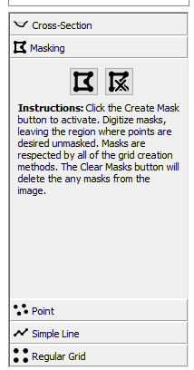

# Grid Preparation Tab

**IVyTools** will process velocities only at grid node locations;
therefore, it is necessary to specify the processing grid locations.
This is the purpose of the Grid Preparation tab.

The Cross-Section Geometry tasks must be completed first (as indicated
by the tab status icon and color) to complete the Grid Preparation
tasks.

At this point, **IVyTools** will contain rectified frames, known
cross-section geometry, and a known cross-section position in the
rectified image. **IVyTools** should look something like this:

## Add Cross-Section Grid

Click the Add Cross-Section button
() to insert the previously
located cross-section line into the image browser. This action will draw
a yellow line at the cross-section's location. Untoggle the Add
Cross-Section Button to exit the edit mode.

Next, set the number of points to create along this line. These points
will be where **IVyTools** computes velocities in the Image Velocimetry
process. The default value is 25 points.

Once set, clicking the Create Points on Line button will add the grid
node points to the line. **IVyTools** will also label the points from 0
to n-1, where n is the number of points.

## Clearing Cross-Section Grid

Click the Clear Cross-Section button to clear the current cross-section
grid and line
(). Conversely, clicking the Add
Cross-Section button
() will clear the existing line
and grid points and recreate the cross-section line.

## Masking

**IVyTools** provides a masking method to prevent grid node points from
being added inside masked regions. Click on the Masking toolbox to
access this functionality.

To create a mask, click the Add Mask button
() to turn on the mask editing
mode. The button will turn blue, indicating editing is active. While the
button is blue, click points in the image to create a polygon region
where grid node points should not be located.

Double-clicking will “set” the polygon.

To clear all existing polygons, click the Clear Masks button
().

To add another polygon, untoggled the Add Mask button and then press it
again to turn it blue again. **IVyTools** is now in edit mode again, and
a new polygon can be added. Repeat this process to add any necessary
masking polygons.

The user can now return to the Cross-Section toolbox and specify the
number of points.

**Note:** **IVyTools** still uses the entire line to create the total
number of points and deleted points inside masking areas. Therefore, the
number of grid node points will be less than the number specified if
masking is in place.

