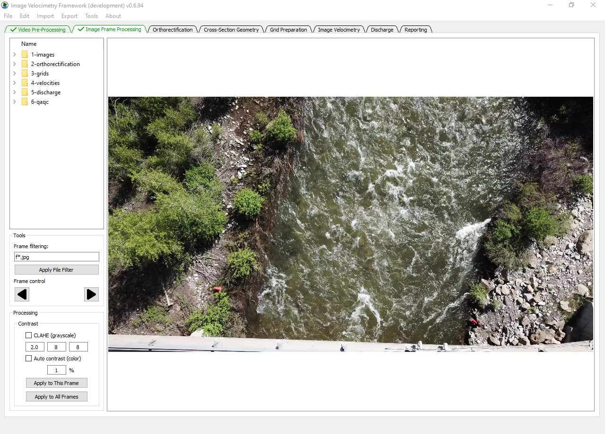
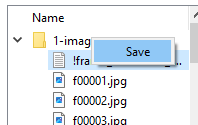
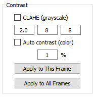

# Image Frame Processing Tab

After a video has been loaded and pre-processed into frames in
**IVyTools**, the Image Frame Processing tab will become active. The
currently loaded frame will be shown in the large image browser on the
right side of the tab.

The user can use the mouse to zoom in or out and navigate/pan within the
image browser.

## Project Manager

On the upper left is a Project Manager feature, which is present for
several of the tabs in **IVyTools**. The Project Manager shows the
contents of the **IVyTools** swap directory, a temporary directory
typically written to the users AppData folder. This directory stores
interim processing artifacts and files associated with **IVyTools**.
Items in this swap directory can be saved by right-clicking on the item
(a folder or file) and following the prompts to save the item to the
user’s desired location.

## Tools

The text in the Frame Filtering box determines the image currently shown
in the image browser. **IVyTools** stores raw video frames as JPEG image
files starting with “f” and numbered in sequence. The Frame filter is a
simple regular expression filter for searching images by name patterns.
Thus, “f\*.jpg” will match all raw image JPEG files starting with “f”.
To change the filter, update the filter text and click the Apply File
Filter button.

The left and right arrow buttons can advance through matched image
frames. Using Ctrl+Left/Right Arrow keys performs the same actions.

## Processing

If desired, the user can apply further image processing to files in this
tab. Set the desired settings and use the Apply buttons to test the
output (Apply to This Frame) or apply to everything (Apply to All
Frames).

### CLAHE (grayscale)

This will apply a Contrast Limited Adaptive Histogram Equalization
(CLAHE) filter to the frames specified by the Frame Filter.

The three numbers indicate the CLAHE clip limit (default of 2) and
horizontal and vertical window sizes, respectively. Click the Apply to
This Frame button to test the CLAHE on the current frame. To reset,
advance the frame and then reverse the frame using the arrow buttons.

### Auto Contrast (color)

The Auto Contrast filter will apply a contrast stretch using the entered
percent. This filter is similar to a typical “auto levels” process but
applies the specific histogram clip before leveling.
