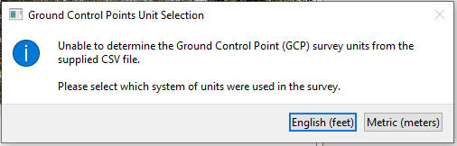

# Orthorectification Tab

The Orthorectification tab contains items related to transforming raw
extracted frames into orthorectified or warped images with a known
ground scale. The basic workflow for orthorectification is:

1.  Load a ground control points image that shows where known survey
    points are located with respect to the camera’s field of view.

2.  Determine the point correspondences between known real-world survey
    coordinates and image pixel locations representing the locations of
    these coordinates in a camera's field of view.

3.  Verify the rectification on a single frame.

4.  Apply the rectification to all extracted frames.

## Rectification Methods

### Scaling

This method requires 2 ground control points. These points and the
corresponding pixel locations will be linearly scaled to the rectified
image. Because this method only uses 2 points, it is the simplest
method. It is suitable for videos collected with a nadir (perpendicular
to the ground) view from cameras without significant distortion.

### Four Point Homography

This method requires 4 ground control points. These points related the
plane of the water surface to the image plane. Because they only relate
these two planes, the 4 points *must* be located on the same level as
the water surface to be valid. For this method to function, all Z
coordinates must be the same elevation, corresponding to the water
surface elevation. This method is suitable for handheld or
tripod-mounted cameras that are not permanently installed.

### Full 3D Camera Matrix

This method requires a minimum of 6 ground control points, although
12–20 are recommended. For this method to be valid, the water surface
elevation must be in the same coordinate reference as the control
points. These ground control points must have X, Y, and Z real-world
Cartesian coordinates. This method is suitable for fixed cameras that do
not move.

## Tab Overview

The Orthorectification Tab contains a Project Manager frame on the left
side, the original and rectified image browsers in the main frame, and
tools associated with the rectification process on the bottom.

## Load a Ground Control Points Image

The Import Ground Control Image (Ctrl+G) menu option in the Import Menu
allows the user to select an image to show in the Original Image
browser.

**Note:** If the user extracted frames in the Video Pre-processing Tab
and selected yes when prompted, the first extracted image may have
already been loaded.

**Note:** It can be helpful to create an annotated ground control point
image using image editing software. One easy way to start this process
is to open the Project Manager “1-images” folder and save one of the
images by right-clicking on a file and choosing save. Then, this image
can be annotated and re-saved to be imported into **IVyTools** as
needed.

## Load a Ground Control Points Table

**IVyTools** requires a comma-separated values (\*.csv) file containing
the point correspondence information for control points. Any text editor
or spreadsheet software can create this file. To load this file, click
the Load GCP Table button
() or use the Import Ground
Control Points Table (Ctrl+T) menu option.

If the table columns in the CSV file include a unit label, then
**IVyTools** will attempt to load the file using those units.

**Note:** **IVyTools** will now convert and display only English units
(feet). Metric unit control points tables can be loaded, but are
converted to English units when displayed.

**Note:** Users can save a Ground Control Points table at any point
using the Save Ground Control Points table button
().

If no unit label was detected in the CSV file, **IVyTools** may ask the
user what units the file was created in.

If pixel coordinates are included in the file, and the “Use in
Rectification” column contains a “truthy” value, the point will be drawn
on the Original Image browser and its Point ID.

### Ground Control Points File Format

**IVyTools** requires a specific file format for the Ground Control
Points table. The easiest way to create a file with the correct columns
is to use the Save Template Ground Control Points File menu option. This
will prompt the user to save a CSV file that is ready to be modified
with actual data.

The following columns are required:

<table>
<colgroup>
<col style="width: 16%" />
<col style="width: 83%" />
</colgroup>
<thead>
<tr>
<th>Column Name</th>
<th>Description</th>
</tr>
</thead>
<tbody>
<tr>
<td>ID</td>
<td>Point ID (String)</td>
</tr>
<tr>
<td>X</td>
<td>X real-world Cartesian Coordinate in feet or meters</td>
</tr>
<tr>
<td>Y</td>
<td>Y real-world Cartesian Coordinate in feet or meters</td>
</tr>
<tr>
<td>Z</td>
<td>Z real-world Cartesian Coordinate in feet or meters</td>
</tr>
<tr>
<td>X (pixel)</td>
<td>X pixel coordinate (can be found in <strong>IVyTools</strong>)</td>
</tr>
<tr>
<td>Y (pixel)</td>
<td>Y pixel coordinate (can be found in <strong>IVyTools</strong>)</td>
</tr>
<tr>
<td>Error X (pixel)</td>
<td>Rectification error of the X-pixel coordinate (not used for all
methods)</td>
</tr>
<tr>
<td>Error Y (pixel)</td>
<td>Rectification error of the Y-pixel coordinate (not used for all
methods)</td>
</tr>
<tr>
<td>Tot. Error (pixel)</td>
<td>Total rectification error of the coordinates (not used for all
methods)</td>
</tr>
<tr>
<td>Use in Rectification</td>
<td>A "truthy" value indicates whether or not to use the point in the
rectification process</td>
</tr>
<tr>
<td>Use in Validation</td>
<td>A "truthy" value indicating whether or not to use the point in the
validation process (not implemented yet)</td>
</tr>
</tbody>
</table>

Here is an example of a valid Ground Control Points Table:

\`\`\`bash

\# ID,X,Y,Z,X (pixel),Y (pixel),Error X (pixel),Error Y (pixel),Tot.
Error (pixel),Use in Rectification,Use in Validation

1,0,0,0,3094.961,1908.624,,,,y,

2,19.2,0,0,936.768,1638.339,,,,y,

\`\`\`

**Note:** The “y” in the Use in Rectification column is considered a
“truthy” value. Other truthy values include True, 1, and Yes. “Falsey”
values include No, n, False, and 0. The values are not case-sensitive.

## Move a Ground Control Point

To move a ground control point and determine its pixel correspondence,
turn on the Point Digitizer tool
(). This will turn the button
blue
(). Click on the row in the
Points Table corresponding to the point to be moved, highlighting the
table row, and activate editing in the Original image. Clicking anywhere
in the Original Image browser will now move the point and update the
table’s X and Y pixel coordinates. Click on the Point Digitizer again to
turn this edit mode off.

## Rectify the Current Image

Once a Ground Control Points image and the Ground Control Points Table
are loaded and configured, and the water surface elevation set, the user
should evaluate the location(s) of Ground Control Points in the Original
Image browser (remember, points have to have a “truthy” value in the
“Use in Rectification” column of the Points Table to be drawn in the
image). When satisfied, the user can click the Rectify Current Image
button to rectify the current frame and display the result in the
Rectified Image browser.

The Rectification Methods will provide a 3x3 or 3x4 transformation
matrix describing the relationship between the point correspondences in
the Export Transformed Frames frame.

The Pixel Ground Scale Distance (GSD) is a crucial rectification process
output. This value indicates how much real-world space is represented by
the pixel. This distance is the width of the pixel. **Note: IVyTools**
presumes that pixels are square.

The user should carefully evaluate the rectification results before
moving on.

### Correcting Flipped or Mirrored Rectification

On occasion, the rectification process can cause the orthorectified
image to “flip” or “mirror” when fitting the camera matrix, as if the
camera was positioned “underneath” the surface. Although these images
and the resulting camera matrix is accuracte, it can make identifying
the channel cross-section and especially left edge of water (used in the
Cross-Section Geometry tab) difficult. For example, consider this
rectified image, noticing the mirrored point label annotatons:

It is apparent from the image that the image should be flipped along the
Y-axis (i.e., the “4” is upside down). This can be corrected in
**IVyTools** by checking the “Flip Rectified Image Y?” option and
pressing the Rectify Current Image button again:

This is an integral part of the rectification process. Users should
ensure that the rectified image appears as expected by modifying the
Flip X or Flip Y button and rectifying the Current Frame, respectively.

## Export Projected Frames

Once the user is satisfied that the rectification process is accurate,
the Export Projected Frames button will apply the rectification to all
current extracted frames (f\*.jpg). **IVyTools** will save new JPEG
files as “t\*.jpg” files in a sequence.

When complete, **IVyTools** will prompt the user to create an “image
stack.” This image stack is required before computing velocity. It can
be created now or from the Image Velocimetry tab. The image stack is an
unsigned integer multidimensional array representing all the images in
memory (and possibly swap space) used during the actual velocimetry
process.

