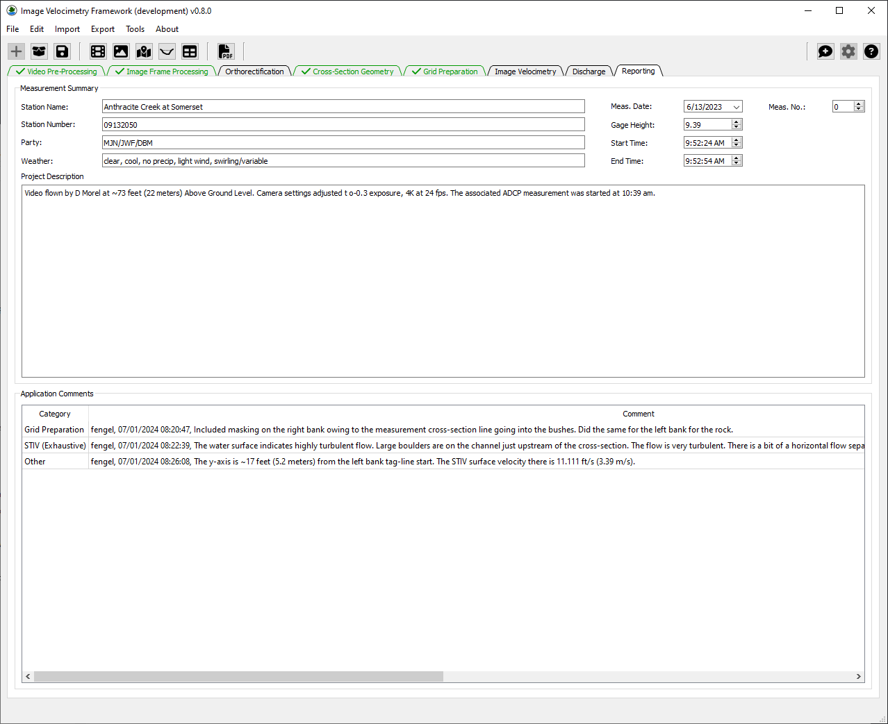
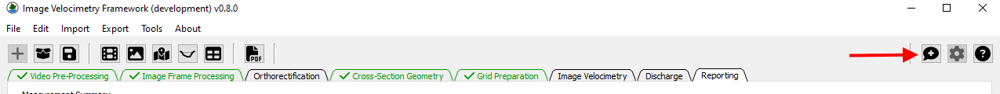
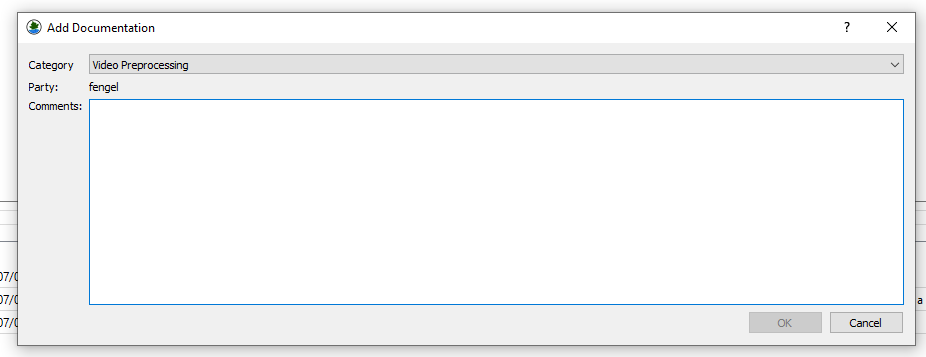
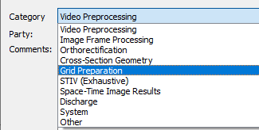
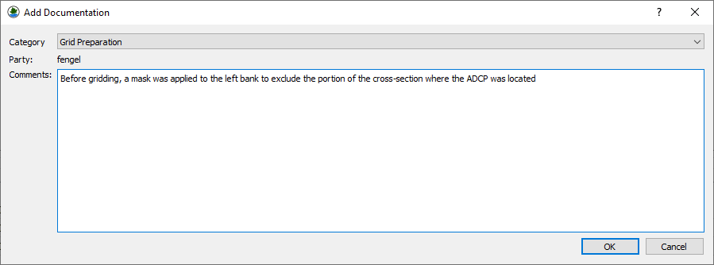
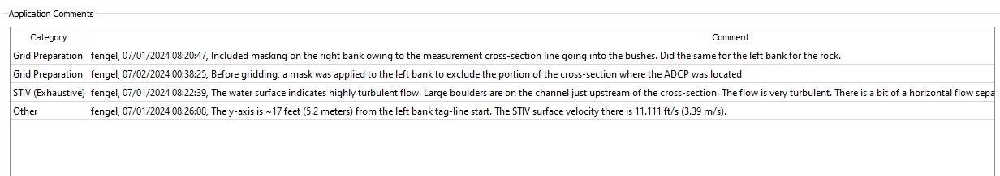
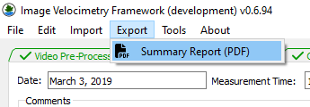
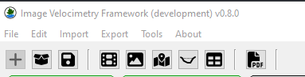
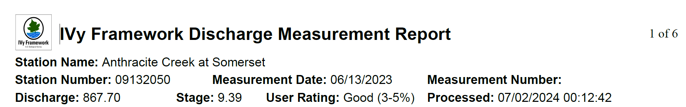
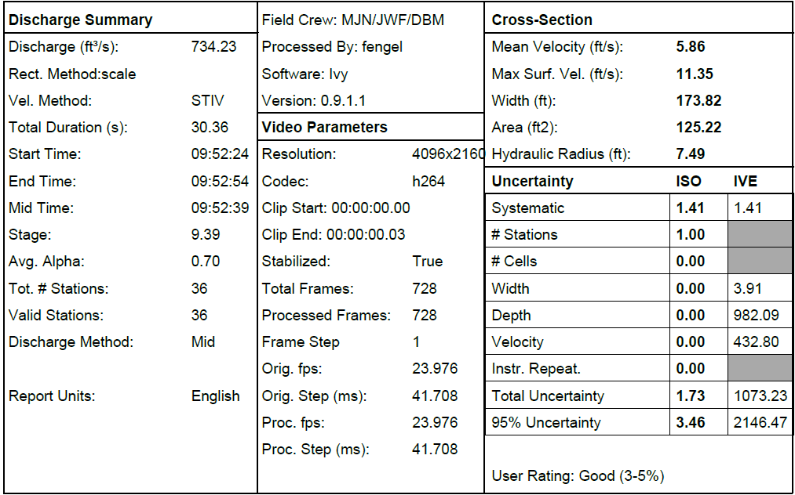

# Reporting Tab

The Reporting Tab provides basic information for the user to add to a
summary Portable Document File (PDF) report suitable for archival
purposes.

## Adding Comments 

Comments can be added at any point while **IVyTools** is open. To add a
comment, press the Add Comment button in the Toolbar’s upper right
portion.

This will open a dialog allowing the user to enter a comment category
and text.

The Category drop-down provides a means of organizing comments by the
relevant processing step (tab).

The user can enter any relevant plain text in the Comments text edit
area.

When the user presses OK, the comment is saved in the Application
Comments table in the Reporting Tab. Each comment is listed in the table
by Category and includes the Windows user name and time stamp when it
was created alongside the text added by the user.

The comments are saved within the project file and included in the
Summary PDF report.

## Creating a Summary Report

The fields in the top portion of the Reporting Tab are editable. The
following fields are included for documenting site metadata:

<table>
<colgroup>
<col style="width: 50%" />
<col style="width: 50%" />
</colgroup>
<thead>
<tr>
<th>Metadata Parameter</th>
<th>Description</th>
</tr>
</thead>
<tbody>
<tr>
<td>Station Name</td>
<td>Location or gaging station name (text)</td>
</tr>
<tr>
<td>Station Number</td>
<td>Station identification number (e.g. 03337000, text)</td>
</tr>
<tr>
<td>Party</td>
<td>Initials of the field personnel responsible for making the
measurement (text)</td>
</tr>
<tr>
<td>Weather</td>
<td>Brief text description of the weather observed during the
measurement</td>
</tr>
<tr>
<td>Meas. Date</td>
<td>The calendar date the measurement was collected (expects a valid
date in MM/DD/YYYY format)</td>
</tr>
<tr>
<td>Gage Height</td>
<td>The associated gage height at the time of the measurement. This may
or may not be the same as the Water Surface Elevation. (float)</td>
</tr>
<tr>
<td>Start Time</td>
<td>The time associated with the start of the measurement in HH:MM:SS
AM/PM format</td>
</tr>
<tr>
<td>End Time</td>
<td>The time associated with the end of the measurement in HH:MM:SS
AM/PM format</td>
</tr>
<tr>
<td>Meas. No.</td>
<td>The number associated with the measurement</td>
</tr>
<tr>
<td>Project Description</td>
<td>A text box for plain text describing the project used to report any
other relevant information not already covered by the above metadata
fields or comments.</td>
</tr>
</tbody>
</table>

Once the user has entered the relevant information and computed Image
velocity, the Summary Report menu option allows them to create a PDF
report.

Or by using the PDF button on the toolbar.

This will prompt the user to save a PDF file to their computer.

The Summary Report contains extensive information about the current
Measurement loaded in **IVyTools**. Of note are the Summary Header,
which is present on each page and includes “at a glance” information
about the current measurement:

Also of note is the Summary Table, which is always included on the first
page of the report:

The subsequent pages detail other measurement and processing information
to aid in the work, check, and review of image velocimetry-derived
streamflow results.
