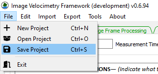
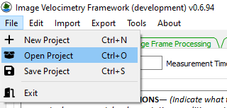

# Saving or Opening a Project

The Image Velocimetry (**IVyTools**) Framework application can save and
open project files for analysis, work, check, and review later. When
saving a project file, the current **IVyTools** state is always saved,
and the application restores the previously saved state when a project
file is loaded in **IVyTools**.

Use the Save Project (Ctrl+S) menu option to save a project.

Use the Open Project (Ctrl+O) menu option to open a previously saved
project.

## IVyTools Project File Structure

When the user saves an **IVyTools** project, the file has a \*.ivy
extension. It is in standard Zip-archive format and viewable outside
**IVyTools** using standard Zip-archive file management software.

The\* .ivy project file includes all information necessary to reprocess
an **IVyTools** project, with the exception of the original video file.
However, if it is saved in the same directory as the \*.ivy project
file, **IVyTools** will attempt to locate it.

As the user processes a measurement in **IVyTools**, several folders and
files will be written to the project structure:

<table>
<colgroup>
<col style="width: 24%" />
<col style="width: 75%" />
</colgroup>
<thead>
<tr>
<th>Project Structure Name</th>
<th>Description</th>
</tr>
</thead>
<tbody>
<tr>
<td>1-images</td>
<td>Contains the extracted frames as images (f%0d.jpg naming format),
and if the project was saved after orthorectifying the transformed
imaged (t%0d.jpg format). This folder also contains the image
stabilization results, including the movement “diff” image
(!f0001_change_overlay.jpg), FFMPEG frame extraction information, and
FFMPEG image transform information (transforms.trf). If STIV has been
completed, the space-time images will also be in this folder.</td>
</tr>
<tr>
<td>2-orthorectification</td>
<td>This folder contains information about the orthorectification
process. It includes the Ground Control Points image
(!calibration_image.jpg), the ground control points table, the
homography or camera matrix used to transform the input imagery, the
pixel ground scale, rectification points information, and water surface
elevation.</td>
</tr>
<tr>
<td>3-grids</td>
<td>Reserved for future features.</td>
</tr>
<tr>
<td>4-velocities</td>
<td>This folder contains information about computed image velocimetry
results.</td>
</tr>
<tr>
<td>5-discharge</td>
<td>This folder contains the discharge table results and cross-section
geometry file.</td>
</tr>
<tr>
<td>6-qaqc</td>
<td>Reserved for future features.</td>
</tr>
<tr>
<td>project_data.json</td>
<td>An internal file with necessary IVyTools settings and information
stores the project's current state.</td>
</tr>
</tbody>
</table>
