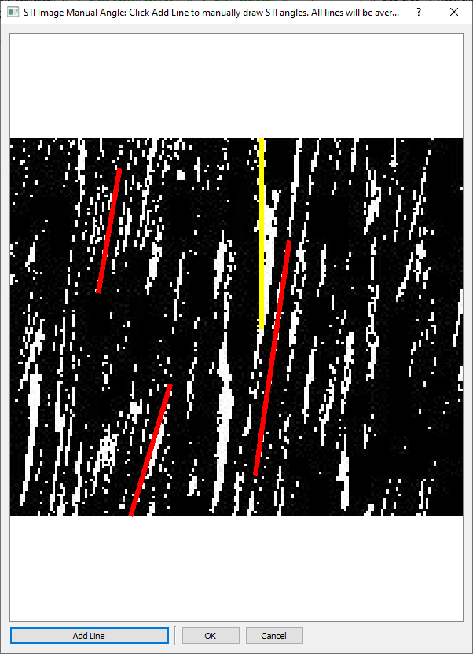

# Space-Time Image Results Tab

The Space-Time Image (STI) Results Tab allows you to examine each grid
node's Space-Time Image Velocimetry (STIV) performance.

This table contains the following columns:

<table>
<colgroup>
<col style="width: 50%" />
<col style="width: 50%" />
</colgroup>
<thead>
<tr>
<th>Column Name</th>
<th>Description</th>
</tr>
</thead>
<tbody>
<tr>
<td>STI</td>
<td>Contains the Space-Time Image. Yellow lines indicate the predominant
angle of streaks in the STI computed by the STIV algorithm. Red lines
indicate the average streak angle determined from manual editing.</td>
</tr>
<tr>
<td>Velocity Direction (deg)</td>
<td>The primary flow direction for a particular node in geographic
coordinates (0° is North).</td>
</tr>
<tr>
<td>STI Stream Angle (deg)</td>
<td>The predominant angle of streaks in the STI as computed by the STIV
algorithm in arithmetic angle (0° is to the right, East).</td>
</tr>
<tr>
<td>Original Velocity Magnitude (ft/s)</td>
<td>The velocity calculated by the STIV algorithm from the STI in feet
per second.</td>
</tr>
<tr>
<td>Manual Velocity Magnitude (ft/s)</td>
<td>If a manual streak angle has been determined, this will be the
velocity calculated from the manual streak angle in feet per second.
Otherwise, this value will be the Original Velocity Magnitude.</td>
</tr>
<tr>
<td>Comments</td>
<td>An editable text field that can be used to add short comments about
a particular node.</td>
</tr>
</tbody>
</table>

## Streak Lines in Space-Time Images

In **IVyTools**, each grid node processed with STIV includes an STI
representing velocities in the image stack for that node. These
velocities form “streaks” in the STI, and the angle of the streaks
represents flow velocities at that node. The STIV algorithm attempts to
find the angle of these streaks automatically, and the results are then
used to calculate the associated velocity.

The STI and grid node results are displayed in the table for review.

The STI for a particular node is also shown, along with a yellow line
representing the angle of the streaks in the image as determined by the
STIV algorithm.

## Manually Reviewing and Editing Streak Lines

Reviewing Space-Time images provides a means for checking the quality
and accuracy of the STIV algorithm and should be a regular part of
computing image velocimetry results using STIV. Sometimes, patterns that
do not represent the mean-flow velocity, such as wind waves,
obstructions, or other artifacts, will cause the STIV algorithm to fail
to identify a valid streak angle. In these cases, it is possible to
manually adjust the streak lines in **IVyTools** manually, often
enabling a valid velocity to be measured.

Consider the following STIV and Space-Time Image result for a drone
video processed in **IVyTools**:

The STIV algorithm found an STI Streak Angle of 90.5° (yellow line),
producing an invalid velocity. However, there are well-defined streaks
in the image. These can be identified manually and corrected, providing
a valid velocity for the discharge computation at this node.

**Note:** the STI Streak Angle (deg) value represents the most prominent
streak angles contained in the STI for a particular velocity node.

Double-click the Manual Velocity Magnitude for the row corresponding to
the node to correct this result manually. This will open a dialog to
better inspect the space-time image:

The dialog shows the space-time image with the STIV resulting angle
(yellow line) radiating out from the center of the image. The user can
zoom in/out and pan using the mouse. The mouse wheel allows zooming in
and out, centering on the current mouse position. Clicking and dragging
a box will zoom to the region of the drawn box. Right-clicking will
return the zoom level to the previous location.

Clicking the Add Line button will digitize a new streak angle. Once
clicked, **IVyTools** expects the user to click the start and end points
of a new streak angle line in the space-time image, which is drawn in
red.

By clicking the Add Line button again, users can add multiple lines to
the image.  

Clicking the OK button will cause **IVyTools** to average the direction
of any drawn lines (shown in red) and calculate a new velocity (in this
example, the “nan” has been replaced by 4.80).

Notice that the averaged manual line is now drawn in the STI column,
indicating the new manual streak angle.

## Commenting on STI Results

The Space-Time Image Results table also includes a Comments column.
Double-clicking any row in this column will allow the user to add text
comments for a particular STI result. These comments are saved in the
**IVyTools** project file.

This capability tracks manual edits and conditions as the measurement is
processed. It is also a handy feature for review.

## Applying Manual STIV Changes

Once the Space-Time Images are reviewed, the user can apply any manual
changes to the discharge computation by clicking the Apply Manual STIV
Changes button.

This will cause **IVyTools** to recompute the velocity component for any
edited nodes in the direction of the cross-section normal (i.e.
perpendicular to the cross-section) and place this value in the
Discharge Stations table in the Discharge tab.

Before:

After:

Note that if the station was marked “Not Used” previously, Applying the
Manual STIV changes will not impact the computed discharge until the
station status is changed back to “Used.”

Additionally, **IVyTools** will plot the new velocity as a red vector in
the Space-Time Image Velocity (Exhaustive) tab:

Before:

After:

## Resetting STIV Results

If the user wants to discard any manual edits at any time, pressing the
Reload Processed STIV Results button will cause **IVyTools** to abandon
changes to the stream angles and revert to the original results.

## Notes on Manual STI Streak Angle Computation

Velocity is determined from the angles of streaks in the space-time
images using the following relationship:

*Unode =* tan *θ* × *Pgsd /* Δ*t*

Where *Unode* is the velocity, *θ* is the angle of the streak
line, *Pgsd* is the pixel ground scale distance, and Δ*t* is
the time between frames.

**IVyTools** assumes that manually corrected streak angles correspond to
velocities occurring in the same direction as the STIV algorithm
computed. Thus, a manually determined velocity represents the corrected
magnitude but not necessarily the correct normal velocity with respect
to the cross-section orientation. **IVyTools** will recompute this
normal velocity component, which is included in the updated Discharge
Stations table when the user clicks the Applying Manual STIV Changes
button.
