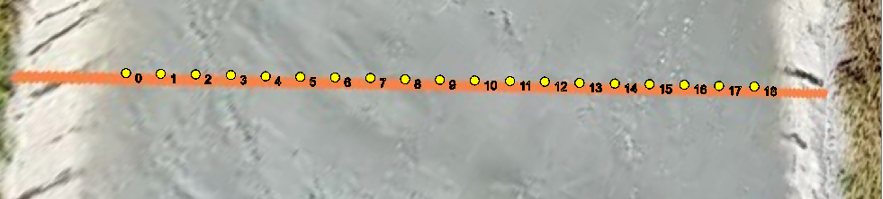
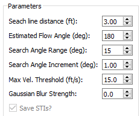
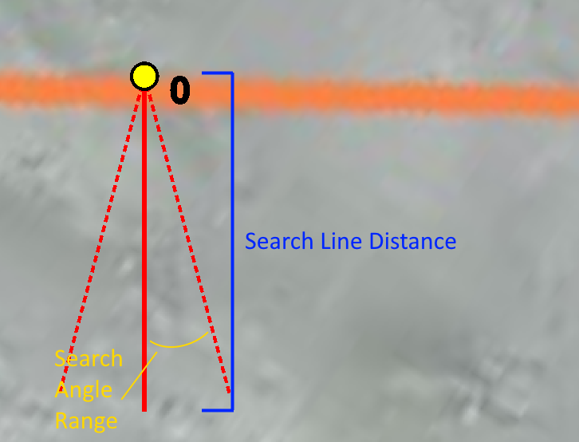
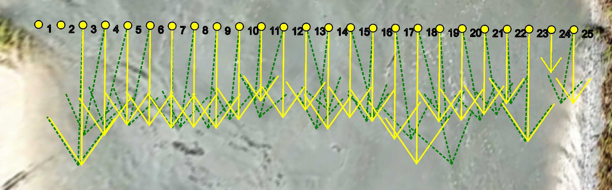

# Space-Time Image Velocimetry (Exhaustive) Tab

The Space-Time Image Velocimetry (Exhaustive) tab provides the tools for
computing two-dimensional Space-Time Image Velocimetry (STIV) in
**IVyTools**. This tab will be active once an Image Velocimetry results
grid has been created.

## Check that an Image Stack has been Created

To process images into velocity, **IVyTools** requires an “image stack”,
or an unsigned 8-bit integer representation of all of the frames, to be
present in memory. When a user extracts projected frames in the
Orthorectification tab, **IVyTools** will prompt the creation of this
image stack. Users can also create or refresh the image stack with this
tab's Create of Refresh Image Stack button. If a tab exists, the button
will be shaded green.

## Verify a Grid Exists

**IVyTools** requires a results grid to process velocities, produced by
the Grid Preparation Tab. If this grid exists, it will be drawn in the
image browser of the tab.

If no points are drawn in the image, return to the Grid Preparation tab
and ensure all the steps needed to create a grid have been completed.

## Parameterize the STIV Settings

There are several parameters to configure for the two-dimensional STIV
(exhaustive) algorithm. A brief description is given below:

<table>
<colgroup>
<col style="width: 30%" />
<col style="width: 69%" />
</colgroup>
<thead>
<tr>
<th>Parameter</th>
<th>Description</th>
</tr>
</thead>
<tbody>
<tr>
<td>Search Line distance (ft)</td>
<td>The total length of a search line in feet.</td>
</tr>
<tr>
<td>Estimated Flow Angle (deg)</td>
<td>An initial guess of the flow direction in geographic degrees (i.e.,
the top of the image is 0°/North, the right is 90°/East, the bottom is
180°/South, and the left is 270°/West). 
 
Choose an approximate angle representing the direction fo the majority
of the flow.</td>
</tr>
<tr>
<td>Search Angle Range (deg)</td>
<td>The envelope of angles used to search for the primary flow
direction, in degrees. For example, 15° will search for primary flow
directions within +/- 7.5° of the Estimated Flow Angle.</td>
</tr>
<tr>
<td>Search Angle Increment (deg)</td>
<td>Angular resolution of the search lines to the consider in
degrees.</td>
</tr>
<tr>
<td>Max Vel. Threshold (ft/s)</td>
<td>Maximum allowed STIV velocity threshold in feet per second.</td>
</tr>
<tr>
<td>Gaussian Blur Strength</td>
<td>Strength of the Gaussian blur applied to Space-Time Images before
attempting to find primary flow angles. A value of 0.0 represents no
blur applied. A value of 5.0 is the maximum blur level.</td>
</tr>
</tbody>
</table>

As the user changes the Parameter values, the image browser will update
to show how the parameters vary the input settings for the STIV
algorithm. For example, given these Parameters:

The STIV grid node will look like this:

## Process Velocities

When satisfied with the Parameters, clicking the Process Velocities
button will start the computation routine. After completion, velocity
vectors will be drawn for all valid results at all grid node locations.

**Note:** STIV results that are not valid (either from exceeding the
Max. Velocity Threshold or from problems with the analysis of the image
stack) will not be drawn. If several vectors are missing, check the
Parameters and the underlying images for issues.

**IVyTools** produces two vectors for each valid grid node when
operating in cross-section mode (prior to any manual corrections). The
green dotted line vector is the two-dimensional velocity results for a
particular node. The solid yellow vector is the component of velocity
perpendicular to the cross-section line (the normal velocity) used in
computing discharge.
