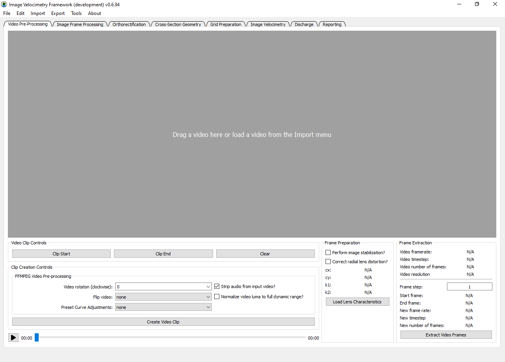
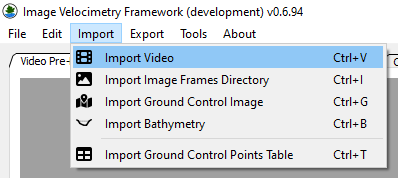
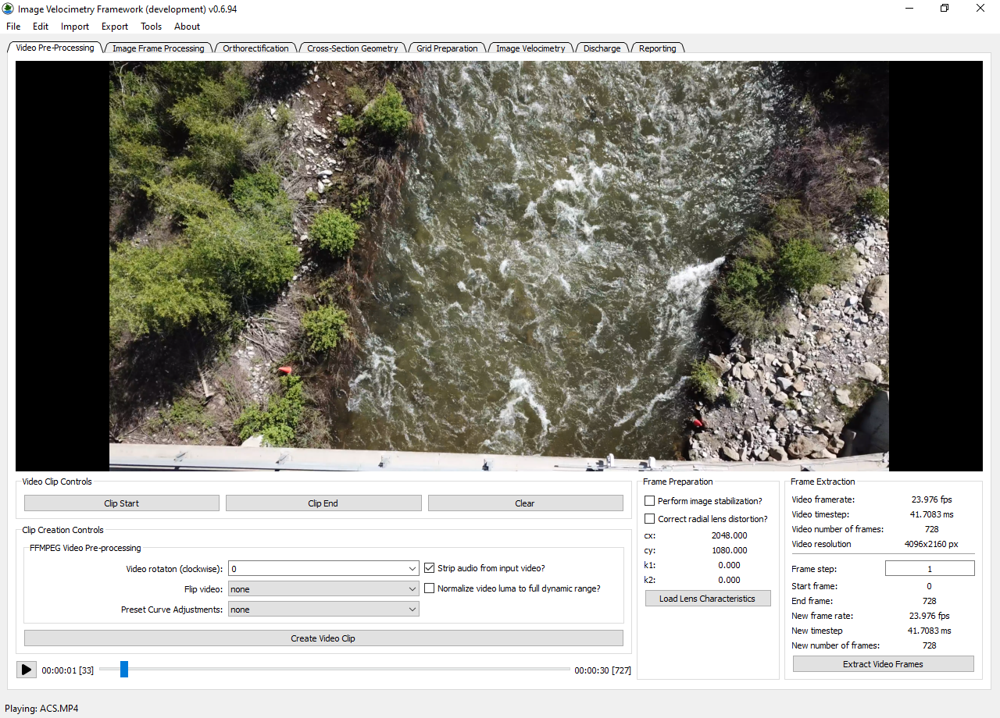
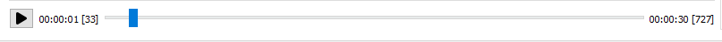
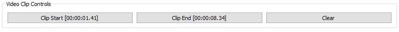
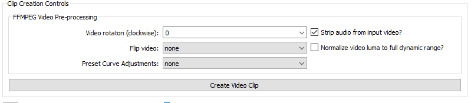
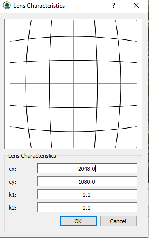
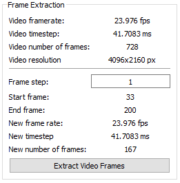
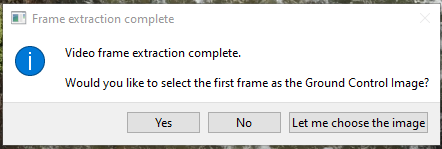
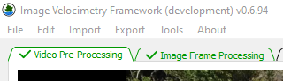

# Video Pre-Processing Tab

The Video Pre-Processing Tab contains items related to loading and
preparing video frames for image velocimetry. Most **IVyTools**
workflows, especially for new projects, will start here.

When **IVyTools** is first started, it will open this tab and prompt the
user to load a video.

## Loading a Video

Videos can be loaded by dragging the file into the video player box or
through the Import Video (Ctrl+V) menu item in the Import menu.

## Video Playback and Review

Once a video is loaded, it begins to play automatically. The user can
review the video using the playback controls.

The video is shown in the large frame of the tab. The playhead and
controls along the bottom of the tab enable users to review the video.

The Play/Pause button is used to start or stop video playback. The text
to the right of the Play/Pause button shows the current time and frame
of the video (in this example, the video is paused on frame 33, at 1
second of playback). The playhead (blue rectangle in Figure 4) and
slider can be moved by clicking, holding it with the mouse, and moving
it from side to side. As it is moved, the video playback will “scrub”
through the video. The text to the right side of the playhead slider
shows the total video length and number of frames (30 seconds and 717
frames in this example).

## Video Clip Controls

When preparing a video for Image Velocimetry analysis, users must decide
what frames must be extracted and processed. Often, this requires a
subset of the video rather than the entire video. To accomplish this
task, the Video Clip Controls enable the user to select a clip’s start
and end points to be processed.

Move the playhead slider to the desired clip starting frame and click
the Clip Start button to set the start frame. Likewise, move the play
head to the desired clip ending point and click the Clip End button to
set the end frame.

The clip start and end times will be indicated on the respective buttons
if a clip is set. If no clip start time is set, the start time will be
the first frame of the video. If no clip end time is set, the end time
will be the last frame in the video. To reset the clip timing, press the
Clear button.

## Clip Creation Controls

**IVyTools** uses the FFmpeg software to extract video information and
frames and perform some additional optional video pre-processing tasks.

Here is a summary of the various optional video pre-processing features:

-   Video rotation: rotate the video clip or extracted frames clockwise
    by the specified degrees.

-   Flip video: apply various flips to the video clip or extracted
    frames.

-   Strip audio from input video: removes any audio track from a video
    clip

-   Normalize video luma to full dynamic range: this filter attempts to
    normalize luminosity across all video clip frames (applied to the
    start and end points). Its impact is to reduce the effect of
    changing shadows on the overall changes in brightness in the video.

-   Preset curve adjustments: this dropdown box contains several FFmpeg
    curve adjustment settings built into the application. More
    information about these presets is found in the [FFmpeg
    documentation](https://ffmpeg.org/ffmpeg-filters.html#curves-1).
    Example applications of each preset can be viewed
    [here](https://hhsprings.bitbucket.io/docs/programming/examples/ffmpeg/manipulating_video_colors/curves.html).

Clicking the Create Video Clip button is an *optional* feature that will
save a video (mpeg4 file) clip according to the currently applied
preprocessing settings. This convenient feature enables users to create
more compact video files of just the measurement section in a video.

## Frame Preparation

These settings are used to apply image stabilization or lens distortion
correction to videos if needed.

### Perform image stabilization

**IVyTools** leverages the FFmpeg implementation of the VidStab library
for image stabilization to remove motion in the video that is not
associated with water movement. The approach to stabilizing videos in
**IVyTools** is a two-pass method. The first pass creates a
transformation log by tracking movement from the video frame by frame.
The second pass applies a correction to this movement, such that a
perfectly applied correction would result in a video as one might expect
if the camera was mounted on a tripod.

To apply video stabilization, check the Perform image stabilization box.

### Correct radial lens distortion

**IVyTools** can also apply a 2-parameter simplified Brown Lens model to
input video to correct for radial (barrel or pincushion) distortion.
Clicking the Load Lens Characteristics button will open a dialog
enabling users to enter predetermined lens characteristics (cx, cy, k1,
k2). These lens characteristics are typically determined using tests and
other software such as the [Camera Calibration Toolbox for
Matlab](https://doi.org/10.22002/D1.20164) or other similar software.

## Frame Extraction

Once the user has configured the video preprocessing settings,
individual video frames can be extracted. The Frame Extraction frame
contains important information about the currently loaded video,
including its framerate and time step, total number of frames, and video
resolution.

Users can determine a new frame timing by setting the Frame Step. A
frame step of 1 indicates that *all* video frames (within the clip start
and end limits) will be extracted. A step of 2 would take every other
frame, 3 would take every third frame, etc. As users change the Frame
Step, the New frame rate, time step, and total number of frames will be
updated.

Once configured as the user desires, clicking the Extract Video Frames
button will start the extraction process. **IVyTools** will process the
video and indicate progress along the bottom right portion of the
application.

When frame extraction is complete, **IVyTools** will ask the user if the
would like to set the first extracted frame as the Ground Control Image.
This can be useful if no other Ground Control image is given or needed.
The user can always load a Ground Control Image later, or choose another
image if desired.

Once the video frames have been extracted, **IVyTools** provides the
user positive feedback indicating workflow step completion by changing
the tab text to green and adding a checkmark icon.

